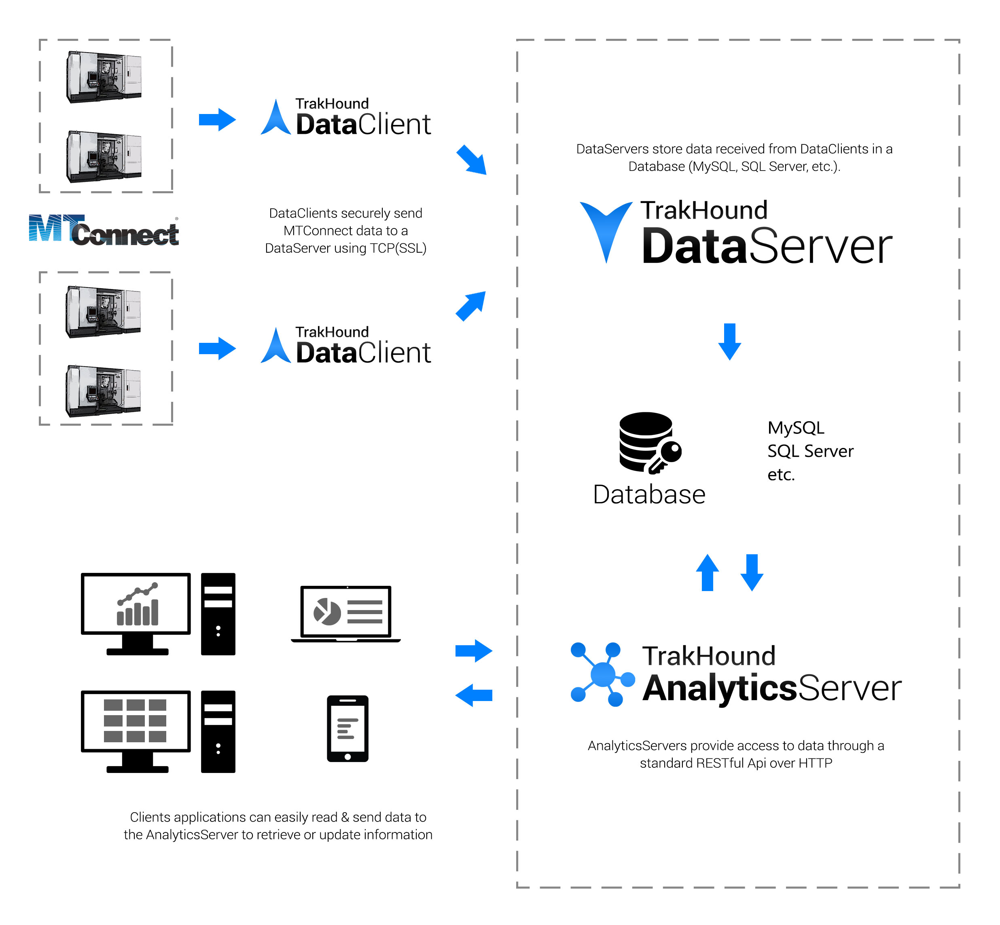

 
 
TrakHound AnalyticsServer is used to retrieve and process MTConnect® data stored in database by a TrakHound DataServer.

# Features
- Process stored MTConnect data
- Uses pluggable modules for REST requests
